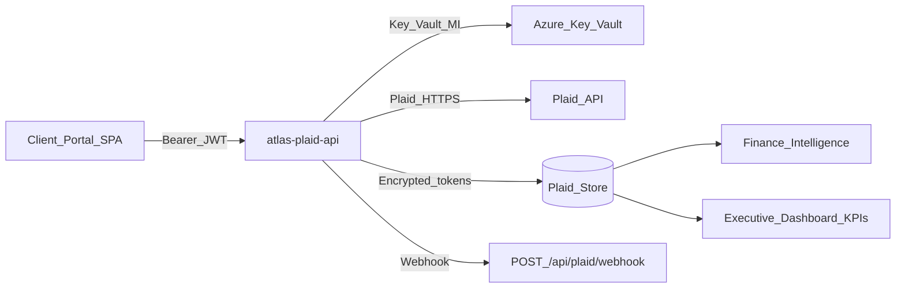

# Plaid Integration — Architecture & Current-State Findings

**As of:** 2026-07-20  
**Branch:** `cursor/plaid-integration`  
**Worktree:** `.worktrees/plaid-integration`  
**Status:** Implementation in progress — Sandbox-first · **NOT production-ready**

---

## 1. Current-state findings

| Area | Finding |
|------|---------|
| Existing Plaid code | **None** — greenfield |
| Client Portal | Present at `apps/hvcg-client-portal` (mock SoR, MSAL not wired) |
| Finance Intelligence | Lives in separate worktree; mappings added here as contract + adapter stubs |
| Backend API surface | **None** historically — Elite OS is SPA → Dataverse. Plaid **requires** a server (secrets cannot live in SPA) |
| Key Vault | `kv-atlas-hvcg-ebc84d85` exists, hardened, **empty** |
| Database | No Prisma/SQL. Atlas uses Dataverse + SharePoint. Plaid store = encrypted local file (Dev) → Dataverse entities (target) |
| Backlog alignment | Closest prior gate **BL-F1** (Mercury/Stripe/bank) — Plaid supersedes bank-connection path for approved products |

---

## 2. Architecture (locked)



### Security controls

1. Plaid `client_id` / `secret` — env (local) or Key Vault (deployed). **Never** `VITE_*`.
2. Access tokens — AES-256-GCM encrypted at rest; ciphertext only in store.
3. Browser receives link tokens + account **metadata** only (mask, type, balances). **Never** access tokens.
4. Every record carries `organizationId` + `clientId` (+ `clientCode`).
5. Auth middleware requires authenticated principal with access to the target `clientId`.
6. Logs redact secrets, access tokens, full account numbers, and Plaid secrets.
7. Approved products only: Auth, Balance, Identity, Liabilities, Statements, Transactions.
8. No payment initiation / money movement.

### Approved products

```
auth | balance | identity | liabilities | statements | transactions
```

---

## 3. Exact implementation plan

| Step | Owner | Artifact |
|------|-------|----------|
| 1 | Master PM | This architecture + assignments |
| 2 | Data Engineering | Schema + migration docs |
| 3 | Azure / Security | API + token vault + Key Vault wiring |
| 4 | Client Portal | Financial Connections UI + Link |
| 5 | Data Engineering | Sync service + webhook |
| 6 | Finance Intelligence | Verified-bank mappings |
| 7 | Security | Security review |
| 8 | QA | Sandbox test plan + GO/NO-GO |
| 9 | Documentation | Runbooks |

---

## 4. Agent assignments

| Agent | Assignment | Status |
|-------|------------|--------|
| Master PM | Scope, order, acceptance | Active |
| Security Engineering | Secrets, encryption, tenant isolation, consent | Pending review of this package |
| Data Engineering | Schema, sync, dedupe, lineage | In package |
| Client Portal | Link UI, reconnect, disconnect, consent | In package |
| Finance Intelligence | KPI mappings, verified labels | Contract + mapper in package |
| Azure / Deployment | Key Vault, webhook URL, env | Runbook ready; secrets blocked on owner |
| QA & Release | Sandbox plan + evidence | Checklist ready; execution blocked on secrets |
| Documentation | Architecture, rotation, incident | In package |

---

## 5. Blockers

| Blocker | Severity | Unblocks |
|---------|----------|----------|
| Plaid Sandbox `client_id` + `secret` not in Key Vault / local `.secrets` | Critical | Live Sandbox Link |
| Webhook public HTTPS URL not approved | High | Webhook-driven sync |
| Portal Entra auth not fully wired (MVP uses session header) | Medium | Production auth |
| Dataverse entity provisioning for Plaid tables | Medium | Prod persistence |
| BL-C1 client invite gate | Medium | Real client users |

---

## 6. Owner actions required

**Do not paste secrets into chat.** Enter them only via the instructions in [OWNER_ACTIONS_PLAID.md](../QA/PlaidIntegration/OWNER_ACTIONS_PLAID.md).

1. Confirm Plaid environment: **Sandbox** first (required).
2. Store Sandbox Client ID in Key Vault secret `plaid-client-id-sandbox`.
3. Store Sandbox Secret in Key Vault secret `plaid-secret-sandbox`.
4. Approve webhook domain (e.g. Azure Function HTTPS host).
5. Confirm Key Vault access for `id-atlas-prod` (or dedicated Plaid API MI).
6. Final Production secret + GO only after Sandbox QA GO.

---

## 7. Acceptance (summary)

Incomplete until Sandbox connection works end-to-end, secrets never appear in code/logs/browser, tenant isolation tests pass, Security + QA issue GO.
