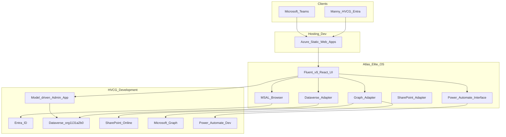

# Track 10 — Microsoft-native architecture (HVCG Development)

**Branch / worktree:** `cursor/track10-elite-ui` · `.worktrees/track10-elite-ui`  
**Status:** Microsoft adapter layer implemented · **awaiting Entra SPA registration + Azure SWA** for hosted play URL

## Architecture diagram

## Frontend

- React + TypeScript + Fluent UI v9 (`apps/atlas-elite-os` + `packages/atlas-design-system`)
- Local Vite is **dev speed only** — production architecture is Microsoft-hosted

## Identity (Entra + MSAL)

- Library: `@azure/msal-browser`
- Tenant: `3df46563-86f3-4414-87fd-84ba967741ef`
- Config: `src/microsoft/config.ts` + `src/microsoft/auth/msal.ts`
- Requires SPA app registration (see Entra requirements below)

## Data

| Concern | Microsoft service | Adapter |
|---------|-------------------|---------|
| Operational Atlas records | Dataverse Dev | `adapters/dataverse.ts` |
| Profile / calendar / files | Microsoft Graph | `adapters/graph.ts` |
| Documents | SharePoint via Graph | `adapters/sharepoint.ts` |
| Automations | Power Automate Dev HTTP | `adapters/powerAutomate.ts` |
| Admin grids/forms | Model-driven app `dea8a490-…` | Admin page link |

Sample data is **fallback only**, labeled (`Development sample` / connection banner).

## Hosting preference

1. **Azure Static Web Apps** (preferred)
2. Azure App Service
3. Embed/link into Teams + model-driven navigation (not Canvas chrome)

## Explicit non-goals

- No separate Atlas database
- No local file store as SoR
- No Production changes
- No live client communications
- Model-driven admin app retained
