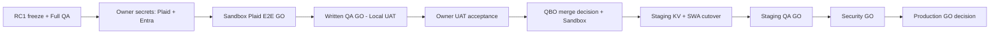

# Executive Program Status Report — Project Atlas

**Authority:** Master Program Manager (Executive PMO)  
**Audit date:** 2026-07-19 (local) / 2026-07-20 UTC evidence pack  
**Method:** Branch/worktree SHA audit · specialist handoffs · Integration RC1 Release pack · Track 1 freeze package  
**Fabrication policy:** Completion claimed only where repository evidence exists.

---

## Executive Summary

Project Atlas has a coherent **Release Candidate 1 (RC1)** on `cursor/atlas-integration-release` that unifies Elite OS, navigation, Banking/Plaid (Sandbox code), Financial Intelligence (pending-verified labels), and Azure foundations into a single local Owner UAT shell at `http://127.0.0.1:5180/`.

**Owner Local UAT: CONDITIONAL GO.**  
**Production: NO-GO** (production readiness score **44%**). Written QA GO is **not issued**.

Parallel specialists have advanced significant work **outside** RC1 (QuickBooks tip, Revenue Sprint 4, portal/ops/AI packages, Track 9/10). The highest program risk is **SoR fragmentation** — multiple stale `PROJECT_STATUS.md` / Master PM / QA dashboards compete with the Integration Release pack. Master PM hereby designates **RC1 Release docs** as the current release authority and freezes RC1 to stabilization/QA (no new feature development on the integration branch).

---

## Overall Completion %

| Scope | Estimate | Basis |
|-------|----------|-------|
| **Program (enterprise production)** | **~42–48%** | RC1 prod score 44% + Track 1 freeze + incomplete QBO/portal/auth/staging |
| **RC1 local Owner UAT (shell)** | **~65%** conditional | Integration RELEASE_CANDIDATE_1 calibration |
| **Track 1 Live—Internal (CRM slice)** | **Frozen complete** | Deployment Engineer freeze package |
| **Revenue OS Dev/Staging (S1–S4)** | **~100% of scoped Dev/Staging** | Tips `0073bf4` + `bf34c93`; not in Elite RC1 |

---

## Current Sprint / Phase

| Phase | Status |
|-------|--------|
| **Elite Integration RC1 — Stabilization + Full QA** | **ACTIVE** (freeze features on integration branch) |
| Revenue Sprint 4 | **COMPLETE** (Dev/Staging) @ `bf34c93` — deferred from Elite RC1 |
| QBO Integration (specialist) | **ACTIVE tip** @ `c892215` — **not merged** into RC1 |
| Parallel mock SPAs (Ops / AI / Exec Intel / Finance Intel / Portal Sprint1) | **Complete or ready** as packages — **deferred** from RC1 merge |

---

## Completed Work (evidence-backed)

| Workstream | Tip / package | Evidence |
|------------|---------------|----------|
| Track 1 Live—Internal freeze | `c726f1e` | Deployment Engineer Track-1 package |
| Elite UI recovery base | `35ca684` | Recovery report; RC1 base |
| Elite Integration RC1 designation | `95ec0fa` (docs) / product `9a26e78` | `PROJECT_ATLAS/Release/*` in integration WT |
| Plaid Sandbox stack (code) | `6d78514` | Unit tests PASS; path-carried into RC1 |
| Revenue Sprints 1–3 | `0073bf4` | Conversion engine + tests |
| Revenue Sprint 4 | `bf34c93` | RELEASE_SUMMARY APPROVE w/ minor |
| Sprint 11 Azure migration | `a386d81` | Sprint 11 executive status |
| Track 9 EOS Sprint 2 | `d778f23` | QA + Owner APPROVED (Dev) |
| Track 10 Elite Owner UAT package | `cd2bd72` | OWNER_UAT_PACKAGE STOP GATE |
| Client Portal data rooms package | `b8b2005` | READY FOR INTEGRATION |
| Finance Ops package | `c79d35b` | READY FOR INTEGRATION |
| Ops Hub (SP) post DEF-QA-001 | `a584f61` | READY FOR INTEGRATION |
| ECC package | `e074cfc` | READY FOR INTEGRATION |
| AI Governance list schemas | `fc1fa79` | READY FOR INTEGRATION |
| AI Governance Sprint 1 SPA | `0dc0c6f` | Mock COMPLETE; deferred RC1 |
| Finance Intelligence Sprint 1 | `c287508` | Mock COMPLETE; deferred RC1 |
| Opportunity CRM offline / merge lineage | `8635397`+ | Offline PASS; Maker OA historically blocked |

---

## Work In Progress

| Specialist | Branch | SHA | % (eng) | Status | Dependencies | Risks / blockers | ETA |
|------------|--------|-----|---------|--------|--------------|------------------|-----|
| Integration & Release | `cursor/atlas-integration-release` | `95ec0fa` | ~65 local / 44 prod | RC1 CONDITIONAL GO | Owner secrets, QA GO | Feature-branch forks | QA cycle |
| QuickBooks Integration | `cursor/quickbooks-integration` | `c892215` | ~75 tip / ~5 in RC1 | Tip built; unmerged | INT-004 merge decision; Intuit secrets | Dual SoR if demos claim QBO live | Owner + IR merge |
| Plaid / Banking | `cursor/plaid-integration` | `6d78514` | ~80 code / 0 live E2E | In RC1; Sandbox E2E BLOCKED | Owner `.secrets` / KV | Live Link PENDING | Owner hours |
| Finance Intelligence | `cursor/finance-intelligence-sprint1` | `c287508` | ~95 mock | Deferred from RC1 | Elite FI surface | Parallel SPA collision | Post-QA |
| Finance Ops | `cursor/finance-operations` | `c79d35b` | ~100 pkg | READY FOR INTEGRATION | Maker OA-FIN | Live schema | Owner Maker |
| Client Portal (SP) | `cursor/client-portal-data-rooms` | `b8b2005` | ~100 pkg | READY FOR INTEGRATION | BL-C1 | External Off | Owner |
| Client Portal Sprint1 | `cursor/client-portal-sprint1` | `1d399eb` | ~90 MVP | Awaiting QA + Elite adapter | Elite SoR | Competing shell | Post-RC1 |
| Executive ECC | `cursor/executive-command-center-active` | `e074cfc` | ~100 pkg | READY FOR INTEGRATION | Master PM merge | Dual exec products | Post-RC1 |
| Executive Intelligence | `cursor/executive-intelligence-sprint1` | `5bb42c2` | ~90 mock | Deferred (Elite covers home) | BL-EI-01..04 | Name collision | Deferred |
| Knowledge / Docs | `cursor/documentation-knowledge-manager` | `2c064b3` | n/a | Stale tip vs RC1 | Release pack | Doc drift | Rebase |
| Revenue OS | `cursor/revenue-sprint4-activation` | `bf34c93` | 100 Dev | COMPLETE Dev/Staging | Prod gates | Not in Elite RC1 | Sprint 5 gated |
| Azure Platform | `cursor/sprint11-azure-production-migration` | `a386d81` | ~95 | COMPLETE Sprint 11 | CORS / Prod SWA | Staging KV | Infra only |
| Power Platform / CRM | CRM WTs + Maker OA | various | offline high / live low | Maker auth / canvas D-002 | Owner pac login | Canvas unpublished | Owner |
| Security Engineering | Plaid + Portal reviews | — | Sandbox CONDITIONAL PASS | Prod NO-GO | Entra JWT, secrets | Prod secrets hold | After Sandbox QA |
| QA / Release Manager | `cursor/qa-release-manager` | `2c064b3` | stale tip | Must rebase to RC1 SoR | Integration Release pack | Dual QA authority | Immediate |
| AI Governance | sprint1 + work-queues | `0dc0c6f` / `fc1fa79` | ~95 / ~100 | Deferred / READY | Approval matrix | Auto-contact lock | Post-RC1 |
| Operations Hub | sprint1 + SP | `0f8f6da` / `a584f61` | ~70–90 / ~100 | Deferred / READY | Registry | Atlas root violation history | Post-RC1 |
| Administration | Elite Admin routes | in RC1 | integrated UI | Role gate pending live QA | Entra | Multi-identity | QA |
| Data Engineering | sample/import packs | — | gated | Pilot BLOCKED | Owner | Pilot not started | Owner |

---

## Critical Path (to Production)

**Blocking now:** Owner Plaid/Entra secrets · Written QA GO · QBO merge decision · Staging Key Vault · DEF-ELITE live retest · Documentation SoR cleanup.

---

## Blocked Items

| ID | Item | Blocker |
|----|------|---------|
| INT-001/002/005 | Plaid Sandbox live E2E | Owner secrets / encryption key / webhook |
| INT-003 | Live Entra sign-in | SPA client ID |
| INT-004 | QBO in RC1 | Specialist tip unmerged; Accounting BLOCKED by design |
| INT-006 | DEF-ELITE live retest | Dev SWA QA checkboxes |
| D-002 / OA-CRM-09 | Canvas publish | Maker rebuild + owner |
| BL-C1 | Portal invites / outbound | Owner |
| BL-PUBLISH-1 | Public DNS | Owner |
| Pilot import | ACCG / Prodigy / Christie | Owner + freeze gates |
| Track 1 extra flows | Prod activation | New owner approval |
| QA written GO | Local + Production | QA agent on RC1 SoR |

---

## High Risks

| Risk | Severity | Mitigation |
|------|----------|------------|
| Parallel Elite forks (`track10` vs recovery vs RC1) | High | Freeze RC1 features; stop track10 feature work |
| Dual QA / status SoR (Jul 15 dashboards vs RC1) | High | RC1 Release pack is sole release authority |
| QBO tip exists but RC1 shows BLOCKED — demo confusion | High | Honest BLOCKED UI; decide merge post-QA |
| Competing shells (Portal Sprint1, Finance/Exec Intel SPAs) | High | Adapter-into-Elite only; defer separate apps |
| Secrets pasted into chat / committed | Critical | `.secrets` gitignored; owner-only |
| Fabricated financial dollars | Critical | Pending labels + recovery finance scan |
| Premature Production | Critical | All quality gates; Track 1 freeze standing |
| Agent registry / Atlas CURRENT_STATE stale | Medium | This audit + SoR refresh |

---

## Upcoming Milestones

1. Full QA against RC1 (written GO / NO-GO)  
2. Owner Local UAT acceptance of RC1 shell  
3. Plaid Sandbox E2E after secrets  
4. QBO merge-or-defer decision (specialist tip `c892215`)  
5. Dev SWA redeploy from RC1 + DEF-ELITE retest  
6. Staging Key Vault readiness (infra only)  
7. Post-RC1 integration queue: Portal adapter, Finance Ops, Ops Hub, AI schemas  
8. Revenue Sprint 5 (only after owner assignment; keep off Elite RC1 until gated)

---

## Owner Decisions Required

1. Complete RC1 Local UAT walkthrough at http://127.0.0.1:5180/  
2. Provide Plaid Sandbox + encryption secrets (never in chat)  
3. Provide / register Entra SPA client ID  
4. Accept or reject RC1 shell for continued stabilization  
5. **QBO:** merge specialist tip into integration **after** QA ACK vs defer  
6. Confirm Track 1 remains frozen (no extra Prod flows)  
7. BL-C1 / DNS / pilot — remain deferred unless explicitly opened  
8. Authorize Documentation + QA agents to rebase onto RC1 SoR  

---

## Recommended Next Specialists (priority order)

1. **QA / Release Manager** — rebase to RC1; issue written Local UAT GO/NO-GO  
2. **Security Engineering** — Sandbox Plaid + Entra review after secrets; keep Prod NO-GO  
3. **Integration & Release** — fixes only; QBO merge planning after QA ACK  
4. **QuickBooks Integration** — hold merge; complete Owner Actions / Sandbox proof on tip  
5. **Documentation** — retire stale root PROJECT_STATUS narratives; point to RC1 pack  
6. **Azure Platform** — staging Key Vault / CORS only (no Prod cutover)  
7. **Do not start:** new Elite feature branches, track10 forks, parallel daily shells  

---

## Estimated Production Readiness

| Gate | Status |
|------|--------|
| Security | **NO-GO** (Sandbox CONDITIONAL; Prod hold) |
| QA | **NO-GO** (written GO not issued) |
| Integration | **CONDITIONAL** (RC1 local READY; Prod NO-GO) |
| Documentation | **PARTIAL** (RC1 pack strong; program Atlas SoR was stale — refreshing) |
| Performance | **PARTIAL** (build PASS; Lighthouse/load NOT RUN) |
| Owner UAT | **CONDITIONAL GO** (local path READY; acceptance pending) |
| Rollback plan | **COMPLETE** (documented in RC1) |
| Deployment plan | **PARTIAL** (local PASS; staging BLOCKED; Prod NO-GO) |

**Official estimate:** Production readiness **~44%**. Earliest credible Production reconsideration is **after** QA GO + Owner UAT acceptance + Sandbox Plaid GO + staging KV validation + Security GO — measured in **owner-driven days/weeks**, not engineer story points.

---

## Naming clarity (do not conflate)

| Name | Meaning |
|------|---------|
| **RC-1** (Jul 16) | Pre–Revenue Sprint 4 documentation lock |
| **RC1** (Jul 19–20) | Elite Sprint 1 Integration Release Candidate on `atlas-integration-release` |

---

## Audit inventory

- **42** git worktrees enumerated  
- Current release SoR: `.worktrees/atlas-integration-release/PROJECT_ATLAS/Release/`  
- Track 1 freeze SoR: `.worktrees/deployment-engineer/releases/Track-1-Live-Internal/`  
- Main checkout: `cursor/agent-communications` @ `912d3ca` (comms/orientation; not Elite product tip)
