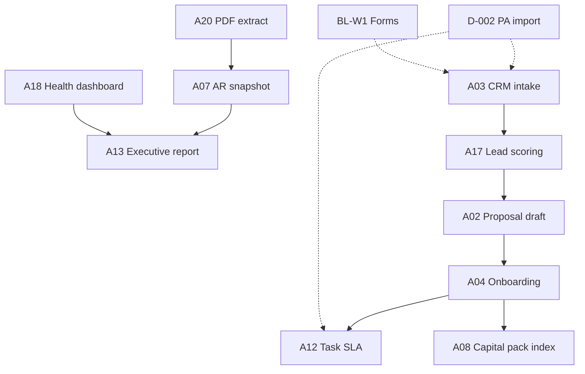

# IMPLEMENTATION_QUEUE

**Team:** Technology and Automation  
**Owner path:** `ai-governance` → Master PM  
**As of:** 2026-07-15 18:45 PT  
**Ranking rule:** `Score = est. hrs/wk saved × feasibility (1–5)` · **Exclude** workflows where **Owner approval needed = Yes** for the *first shippable slice* (send / money / Prod).  
**Environment:** Dev and draft artifacts only · **No live email sends · No payment flows · No Prod**

**Feasibility scale**

| Score | Meaning |
|-------|---------|
| 5 | Spec + scripts exist; no creds gate for Dev slice |
| 4 | Minor wiring; lists/templates ready |
| 3 | Blocked on **D-002** (PA import) but buildable in repo |
| 2 | Needs **BL-GRAPH-1** or **BL-W1** |
| 1 | Multi-gate / legacy owner decisions |

---

## Top 10 (no owner gate on first slice)

| Rank | ID | Workflow | Hrs/wk | Feas. | **Score** | First shippable slice | Primary blocker after slice |
|------|-----|----------|--------|-------|-----------|----------------------|----------------------------|
| **1** | A03 | CRM updates (EVA → Lead) | 4.0 | 5 | **20.0** | Forms → PA → `HVCG_Leads` upsert + idempotency in Dev | **BL-W1** for live form trigger |
| **2** | A13 | Executive reporting assembly | 2.0 | 5 | **10.0** | Nightly agent refresh `EXECUTIVE_SNAPSHOT` + dashboard JSON from registers | None (markdown/lists) |
| **3** | A07 | Financial reporting (AR snapshot) | 2.0 | 5 | **10.0** | Weekly PA/script: `pdf_billing_extracts` → `AR_Outstanding` metric row | CRM import optional |
| **4** | A18 | Client health dashboard regen | 1.5 | 5 | **7.5** | Extend `generate_client_profiles.py` → rubric scores → MD+JSON | None |
| **5** | A12 | Task SLA rules | 2.0 | 4 | **8.0** | Template JSON → `HVCG_Tasks` seed on project create (Dev list) | **D-002** for PA trigger |
| **6** | A08 | Capital package index | 2.0 | 4 | **8.0** | Library scan → manifest + QC task list | Client library paths |
| **7** | A17 | Lead scoring refresh | 1.0 | 4 | **4.0** | Batch recompute `LeadScore` on open leads | **D-002** for schedule |
| **8** | A20 | Invoice PDF extract | 1.5 | 4 | **6.0** | `pypdf` batch → update `pdf_billing_extracts.json` | Python dep install |
| **9** | A02 | Proposal draft (unsent) | 3.0 | 3 | **9.0** | Pricing engine JSON + DOCX to Dev library; `owner_approval_required` | Price approval (not automation); delivery **BL-C1** |
| **10** | A04 | Onboarding pack (no invite) | 3.0 | 3 | **9.0** | Won → shell Account/Engagement/project/doc requests; skip comms | **D-002**, **BL-C1** for welcome |

**Note:** A02 and A04 tie at 9.0; A02 ranks above A04 because funnel revenue impact and spec completeness (`PROPOSAL_TEMPLATE`).

---

## Scoring detail (excluded from top 10 — owner gate on slice)

| ID | Workflow | Hrs/wk | Feas. | Raw score | Why excluded |
|----|----------|--------|-------|-----------|--------------|
| A01 | Email triage | 5.0 | 2 | 10.0 | **BL-GRAPH-1**; send path **BL-C1** |
| A11 | Follow-up drafts | 3.0 | 3 | 9.0 | First value = draft emails → send gated **BL-C1** |
| A05 | Meeting scheduling | 2.0 | 2 | 4.0 | External invite **BL-C1** |
| A06 | Document chase | 3.0 | 3 | 9.0 | Client notify **BL-C1** |
| A09 | Lender packages | 2.5 | 3 | 7.5 | External share **BL-C1** |
| A10 | Investor updates | 1.0 | 3 | 3.0 | Send **BL-C1** |
| A16 | Legacy migration | 2.0 | 3 | 6.0 | **BL-ACCG-*** owner gates |

---

## Sprint plan (recommended)

### Sprint 1 — Registers & dashboards (no PA import)

| Order | ID | Deliverable | Est. effort |
|-------|-----|-------------|-------------|
| 1 | A13 | `EXECUTIVE_SNAPSHOT` auto-assembly script | 1 day |
| 2 | A18 | Client health batch regen wired to rubric | 1 day |
| 3 | A07 | AR snapshot from invoice extracts | 0.5 day |
| 4 | A20 | PDF extract pipeline fix | 0.5 day |

**Sprint 1 savings:** ~7 hrs/wk when run on schedule.

### Sprint 2 — CRM Dev writes (pre **BL-W1**)

| Order | ID | Deliverable | Est. effort |
|-------|-----|-------------|-------------|
| 5 | A03 | PA flow definition + manual trigger / test payload | 2 days |
| 6 | A17 | Lead score recompute child flow | 0.5 day |
| 7 | A12 | Project template → task seed | 1 day |

**Sprint 2 savings:** +5 hrs/wk after **D-002** import.

### Sprint 3 — Revenue path drafts (still no send)

| Order | ID | Deliverable | Est. effort |
|-------|-----|-------------|-------------|
| 8 | A02 | Proposal generator Dev output | 2 days |
| 9 | A08 | Capital package indexer | 1 day |
| 10 | A04 | Onboarding orchestration Dev dry-run | 2 days |

**Sprint 3 savings:** +6 hrs/wk internal; client-facing still **BL-C1**.

---

## Dependencies

---

## Success metrics

| Metric | Target (90 days) |
|--------|------------------|
| Manny manual hrs/wk replaced | ≥25 of ~50 cataloged |
| Dev automation runs/week | ≥50 without failure |
| Owner gates hit in automation | 0 unapproved send/money/prod |
| Executive snapshot staleness | <24h |

---

## Explicit non-goals (this queue)

- Live Outlook/Graph send
- Mercury / Square / Stripe / bank OAuth (**BL-F1**)
- Prod CRM / SharePoint / Power BI publish (**PROD-1**)
- Portal invites or client-facing email (**BL-C1**)
- ACCG price/class decisions without owner

---

## Cross-reference

Full workflow specs: `AUTOMATION_CATALOG.md` (22 entries, **A01–A22**)
