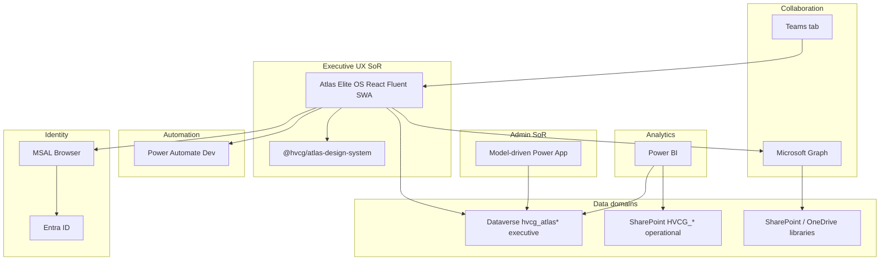
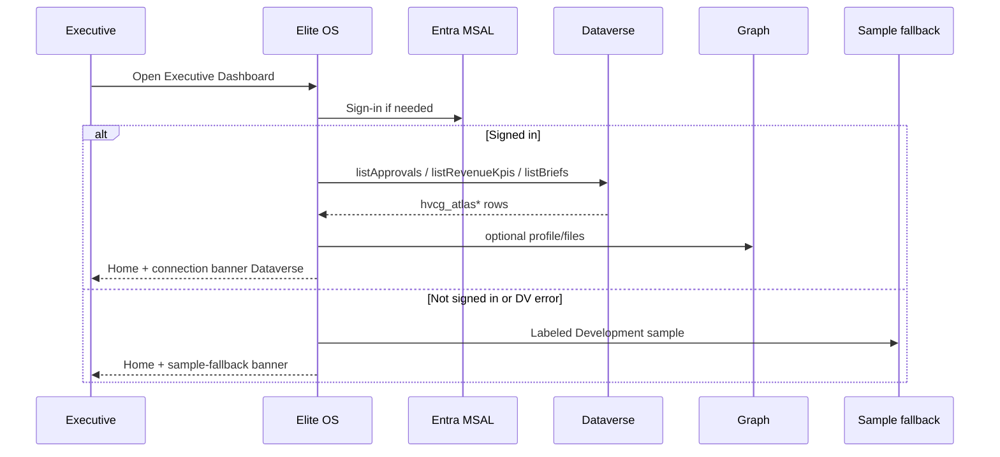

# MASTER PM PACK — Executive Dashboard Architecture Sign-Off

**From:** system-architect  
**To:** Master PM  
**Date:** 2026-07-20  
**Scope:** Product-build only (HVCG Executive Dashboard). **Out of scope:** Atlas Runtime, Cursor Cloud Agents, ATLAS-R, Durable Functions, Service Bus dispatchers.  
**Binding ADR:** [ADR-0006](ARCHITECTURE_DECISIONS/ADR-0006-elite-os-executive-dashboard-ux-sor.md) — **Accepted**

---

## 1. Current architecture assessment

### What exists (evidence-based)

| Layer | State | Location / evidence |
|-------|--------|---------------------|
| Elite OS SPA | Working shell + Executive Home; MSAL + adapters | `.worktrees/track10-elite-ui/apps/atlas-elite-os` |
| Design system | Reusable Fluent v9 package | `packages/atlas-design-system` |
| Hosting | SWA Dev deployed | `https://zealous-rock-0090c7e1e.7.azurestaticapps.net` |
| Model-driven admin | Deployed Dev | `org1131a2b0` app `dea8a490-…` |
| Dataverse Atlas tables | Approvals, Revenue KPIs, Briefs consumed by SPA | `hvcg_atlasapprovals`, `hvcg_atlasrevenuekpis`, `hvcg_atlasbriefs` |
| SharePoint operational lists | ~83 schemas; classic HVCG OS SoR | `src/sharepoint/lists` |
| Power Automate | CRM/ops flows; Teams notify off | Solution `HVCGCommandCenterDev` |
| Canvas app | **0** published `.msapp` | Deferred |
| Legacy mock dashboards | Multiple `executive-dashboard.js` copies | **Abandoned for product UX** |
| Workspaces | HVCG internal + Colorado Craft Beef (pending-safe finance) | `src/data/workspaces.ts` |

### Architecture health (product Exec Dashboard): **68%**

Strong Microsoft-native skeleton and clear Track 10 docs; module routes still placeholders; dual SoR (SharePoint ops + Dataverse Atlas) needs disciplined contracts; sample KPI fallback remains a demo risk if unlabeled.

### Findings summary

| Category | Finding |
|----------|---------|
| Reusable | Design system components; MS adapters; workspace catalog pattern; env config (`VITE_*`) |
| Duplication | Mock SPAs + Elite OS + canvas specs; dual executive KPI concepts (SharePoint vs `hvcg_atlas*`) |
| Coupling | Home page mixes Dataverse KPI/approvals with sample activity/clients — OK short-term if labeled |
| Debt | Placeholder modules; incomplete Entra group → SPA role mapping; bundle size (TD-002) |
| Security gaps | Role simulation incomplete; CORS must stay correct for SWA origin |
| Performance | Bundle >500kB noted; spark charts hardcoded when mapping KPIs |
| Data inconsistency | Classic dictionary says SharePoint SoR; Elite path uses Dataverse for exec tables — **resolve via ADR-0006 dual-domain rule** |
| Abandoned | `hvcg-engineering-os` executive dashboards; unpublished canvas as exec UX |
| Deploy risk | Prod PP owner-gated; Test env planned; SWA “production” slot ≠ business Production |

---

## 2. Approved target architecture

**Verdict:** Target architecture for the Executive Dashboard is **APPROVED** (ADR-0006).

---

## 3. System boundaries

| Boundary | Owner technology | Rules |
|----------|------------------|-------|
| **UI** | Elite OS + design system | No second React app; no canvas exec rebuild |
| **Application services** | Thin adapters in `src/microsoft/adapters/*` | No custom middleware platform; version via Dataverse API `v9.2` |
| **Data (operational)** | SharePoint `HVCG_*` lists | CRM/delivery/capital/finance-ops |
| **Data (executive Atlas)** | Dataverse `hvcg_atlas*` | Approvals, KPI records, briefs, future exec entities |
| **Documents** | SharePoint libraries via Graph | Never local FS SoR |
| **Automation** | Power Automate | Idempotent; no live client comms without gate |
| **Analytics** | Power BI | Read models; no transactional writes |
| **AI** | Human-gated; label generated vs verified | No auto-send |
| **Authentication** | Entra + MSAL SPA | Public client; no secrets in repo |
| **Authorization** | Dataverse security roles + Entra groups | SPA must not invent elevated rights |
| **Logging** | App Insights (wire task) + Dataverse/`HVCG_AutomationLogs` | Structured; no PII in client logs |
| **Configuration** | `VITE_*` + Power Platform env vars `hvcg_*` | Environment-based; SWA app settings |

---

## 4. Component map

| Component | Package / path | Reuse rule |
|-----------|----------------|------------|
| AtlasProvider, tokens, themes | `@hvcg/atlas-design-system` | Mandatory for Elite pages |
| AtlasCard, DashboardWidget, DataTable, StatusChip, NavShell, CommandBar, Search/AI, Dialog, EmptyState, LoadingState | design-system | Compose modules only from these (+ Fluent primitives) |
| AppShell + routes | `apps/atlas-elite-os` | Single product shell |
| AuthProvider / MSAL | `microsoft/auth` | Sole auth entry |
| dataverse / graph / sharepoint / powerAutomate adapters | `microsoft/adapters` | Sole integration edge |
| Workspace catalog | `data/workspaces.ts` | Pattern for HVCG internal + client workspaces |
| ModuleScaffold | `pages/shared` | Replace PlaceholderModule for Sprint 14 modules |

---

## 5. Integration map

| From → To | Contract | Notes |
|-----------|----------|-------|
| Elite → Entra | OAuth2/OIDC SPA | Tenant `3df46563-…`; client via `VITE_ENTRA_CLIENT_ID` |
| Elite → Dataverse | Web API OData v9.2 bearer | Tables `hvcg_atlas*` |
| Elite → Graph | Graph v1.0 bearer | Profile, calendar, files/sites |
| Elite → Power Automate | HTTPS trigger base URL | Empty = disabled |
| Elite → MDA | Deep link | Admin page |
| Teams → Elite | Tab URL = SWA | Frame ancestors in `staticwebapp.config.json` |
| Flows → SharePoint/Dataverse | Solution connection refs | Shared `hvcg_shared*` |
| Power BI → SP/DV | Import/DirectQuery | One enterprise semantic model |

---

## 6. Data-flow diagram (Executive Home)

**Hard rule:** Financial values only from verified Dataverse/SharePoint sources or **pending labels** — never invented dollars.

---

## 7. Permission model

| Actor | Exec Dashboard | Dataverse Atlas | SharePoint ops | Graph | Automate | Live client comms |
|-------|----------------|-----------------|----------------|-------|----------|-------------------|
| Owner (Manny) | Full UX | R/W Dev | Per existing | User read | Invoke Dev | Blocked unless gate |
| HVCG staff | Role-scoped UX | Security roles | Groups | Delegated | As licensed | Blocked |
| SPA public client | User token only | Via user | Via user | Via user | HTTP + user | Blocked |
| Model-driven admin | N/A (separate) | Maker/admin | N/A | N/A | N/A | N/A |

Production Dataverse/SharePoint and PP promotion remain **owner-gated**.

---

## 8. Product entity standardization

Dual-domain mapping (do not merge stores prematurely):

| Required entity | Operational SoR (SharePoint) | Executive / Atlas (Dataverse) | Notes |
|-----------------|------------------------------|-------------------------------|-------|
| organizations | (future) / Clients hub | workspace `organizationId` later | SaaS seed = workspace |
| clients | `HVCG_Clients` | Client workspace records | `ClientCode` bridge |
| contacts | `HVCG_Contacts` | — | |
| users / roles | Entra + TeamMembers | DV security roles | |
| opportunities | `HVCG_Opportunities` | optional KPI rollup | |
| referral sources | ReferralPartners/Referrals | workspace.referralSource | |
| engagements / projects / milestones / tasks | Engagements, Projects, Milestones, Tasks | module pages read via adapters | |
| approvals | `HVCG_Approvals` | **`hvcg_atlasapprovals`** (exec inbox) | Keep in sync via flow later |
| risks / issues / decisions / meetings / notes | Risks, Issues, Decisions, Meetings, Communications | — | |
| financial periods / KPI / forecasts | Budgets, RevenueForecastLines | **`hvcg_atlasrevenuekpis`** | No invented values |
| capital / lenders / investors / conditions | Capital* lists | Capital module | |
| documents / document requests | Libraries + DocumentRequests | Graph/SP adapter | |
| EVA / value drivers | EVA staging + lists | Enterprise Value module | |
| AI insights | AI queues | **`hvcg_atlasbriefs`** + AI module | Label generated |
| notifications / audit | Notifications, AuditEvents | App Insights + audit lists | |

---

## 9. Major risks

| ID | Risk | Sev | Mitigation |
|----|------|-----|------------|
| PR-1 | Fabricated finance in demos | HIGH | Pending labels; QA fail on unlabeled $ |
| PR-2 | Dual UI resurrection (canvas/mock) | HIGH | ADR-0006 freeze |
| PR-3 | SharePoint vs Dataverse drift | HIGH | Business-key bridge; architect review on shared contracts |
| PR-4 | Incomplete authZ in SPA | MED | Wire Entra groups / DV roles before Prod |
| PR-5 | Module placeholders ship as “done” | HIGH | Sprint 14 DoD; QA gate |
| PR-6 | CORS / Entra misconfig breaks hosted UAT | MED | Keep SWA origin allow-list current |
| PR-7 | Premature multi-tenant platform | LOW | Workspace model only |

---

## 10. Required architecture decisions (status)

| ID | Decision | Status |
|----|----------|--------|
| ADR-0006 | Elite OS = Exec Dashboard UX SoR | **Accepted** |
| ADR-0002 (orch) | Shared connection refs | Accepted (platform) |
| ADR-0004 | Shared Approvals contract | Accepted — sync plan to `hvcg_atlasapprovals` still needed |
| D-CANVAS-EXEC | Publish canvas exec app? | **Rejected for this release** (aligns Master PM) |
| D-DV-MIGRATE-OPS | Move all SharePoint ops to Dataverse now? | **Deferred** — phased only |
| D-TENANT | Full multi-tenant isolation | **Deferred** — workspace kinds only |

---

## 11. Approved development constraints

1. Microsoft-native stack only (React/TS/Fluent, Power Platform, Dataverse, SharePoint, Graph, Teams, Outlook, OneDrive, Power BI, Entra, Azure).  
2. Elite modules **must** use `@hvcg/atlas-design-system`.  
3. No second frontend, DB, IdP, or workflow system without a new ADR.  
4. No fabricated financial metrics.  
5. Strong typing; adapters are the only I/O boundary; env-based config; no secrets in git.  
6. Accessibility + responsive shell required for Exec Home and modules.  
7. AI outputs labeled generated vs verified.  
8. HVCG internal and client workspaces share the same shell, design system, adapters, and permission patterns.  
9. Dev SWA + HVCG Development only for agent deploy; Prod PP owner-gated.  
10. Architect reviews shared schema / env / connection / auth boundary changes.

---

## 12. Deployment and rollback (confirmed)

| Step | Architecture |
|------|----------------|
| Build | `npm run build -w @hvcg/atlas-elite-os` |
| Host | Azure Static Web Apps (Dev) |
| Config | SWA app settings for `VITE_*`; Entra redirect + Dataverse CORS |
| Teams | Personal/channel tab → SWA HTTPS |
| Rollback | Prior SWA revision; remove Teams/sitemap link; **do not** delete Dataverse/MDA/SharePoint |
| PP Prod | Not in Executive Dashboard SPA rollback path |

Reference: `Track10_Hosting_Teams_Rollback.md`.

---

## 13. Multi-tenant readiness (without overengineering)

**Now:** `WorkspaceKind = internal | client`; shared components; data filtered by workspace id / ClientCode.  
**Later (SaaS):** `organizationId` on Dataverse tables, Entra guest/B2B, per-tenant SWA config or path routing — **only after** internal+client workspace pattern is stable.

---

## 14. Final technical sign-off

| Item | Decision |
|------|----------|
| Target architecture (Exec Dashboard) | **APPROVED** |
| Elite OS as UX SoR | **APPROVED** (ADR-0006) |
| Model-driven as admin SoR | **APPROVED** |
| Canvas exec rebuild this release | **NOT APPROVED** |
| Proceed Sprint 14 module implementation under these constraints | **APPROVED** |
| Production Power Platform promotion | **NOT APPROVED** (owner gate) |

**Sign-off:** system-architect — 2026-07-20  
**Condition:** QA must fail release if placeholders or unlabeled financials remain on the demo path.

Architect remains active through implementation, QA, Dev SWA verification, and release checklist — product track only.
