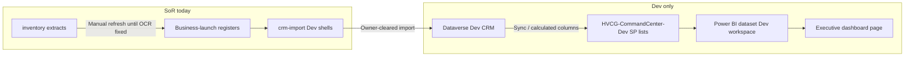

# COMMAND_CENTER_WIRE_PLAN

**As of:** 2026-07-15 18:35 PT  
**Environment:** **Dev only** — `HVCG Development` · `HVCG-CommandCenter-Dev` · Dataverse Dev (`org1131a2b0.crm.dynamics.com`)  
**Forbidden:** Prod publish · live financial connects · tenant writes until Master PM / owner clears · portal invites (BL-C1)

---

## Goal

Wire Executive Dashboard metrics from **real CRM list rows** (post Dev import) into SharePoint Command Center Dev and Power BI — replacing markdown snapshots without using demo/sample client data.

---

## Architecture (target)



---

## Phase 0 — Preconditions (current)

| Gate | Status | Owner / ops |
|------|--------|-------------|
| Dev CRM client rows | Shell JSON only — **not imported** | Master PM clears Dev write |
| BL-ACCG-PRICE | Open | Manny — frozen billing amount |
| BL-W1 | Open | SP Comm Site + Forms |
| BL-PNP-1 | Open | PnP URLs + Connect-PnPOnline |
| BL-F1 | Deny default | No Mercury/Square/Cash App connect |
| PDF extract | Blocked | Install pypdf/pdfminer for invoice/agreement OCR |

**Until Phase 0 clears:** `executive/DASHBOARD_MOCK_VALUES.md` remains authoritative snapshot.

---

## Phase 1 — CRM list mapping (Dev)

Map `CLIENT_DATA_MODEL.md` entities to existing RC-1 / CRM module lists (additive fields via recommendation — no locked-index edits without architect window).

| Dashboard metric | CRM source | List / field (logical) | Transform |
|------------------|------------|------------------------|-----------|
| `ActiveClients_HVS` | Account | `Classification=HVS_LEGACY_*`, `IsActive=true`, `ContractingEntity=High Value Solution LLC` | COUNT |
| `ActiveClients_HVCG` | Account | `Classification=HVCG_NEW_CLIENT`, `IsActive=true` | COUNT |
| `ContractedMRR_Verified` | Engagement | `MonthlyRetainer` WHERE `PricingStatus=VERIFIED` | SUM |
| `ContractedMRR_Unverified` | Engagement | `MonthlyRetainer` WHERE `PricingStatus` IN (OWNER_VERIFY, EXTRACTED_VERIFY_*, INVOICE_PDF_PENDING) | SUM with **exclude null**; ACCG single row only after owner pick |
| `PipelineValue` | Opportunity | Open stages × `EstimatedValue` | SUM |
| `WebsiteLeads` | Lead | Created from SP Form (post BL-W1), source = Website | COUNT MTD |
| `AR_Outstanding` | Invoice | `BalanceDue` WHERE `Status=Open` | SUM |
| `OnboardingPct` | Account / custom | Migration checklist completion % | AVG or calculated |
| `PortalEnabledCount` | Account | `PortalEnabled=true` | COUNT |

**Import path:** Dev-only packages in `crm-import/*_dev_shell.json` → Dataverse Dev via approved import script (not run until cleared).

---

## Phase 2 — SharePoint Command Center Dev (`DS-SP-CC-DEV`)

| Step | Action | Tooling |
|------|--------|---------|
| 1 | Authenticate PnP to Dev tenant | `Connect-PnPOnline` — requires **BL-PNP-1** |
| 2 | Create / confirm lists: `ExecutiveMetricsSnapshot`, `MetricLineItems` | PnP provisioning script in repo (Dev profile) |
| 3 | Scheduled Power Automate (Dev): nightly read Dataverse → upsert SP list rows | `DS-PA-FLOWS` — Dev environment only |
| 4 | Command Center home: JSON/HTML web part bound to `ExecutiveMetricsSnapshot` | SP Comm Site (same site as website post BL-W1 or dedicated Dev page) |

**List schema — `ExecutiveMetricsSnapshot`**

| Column | Type | Example |
|--------|------|---------|
| SnapshotDate | DateTime | 2026-07-15 |
| MetricId | Choice | ActiveClients_HVS |
| Value | Number / text | 2 or null |
| Verified | Yes/No | false |
| SourceRegister | Text | PRICING_REGISTER |
| Notes | Multiline | UNVERIFIED Prodigy 7500 |

---

## Phase 3 — Power BI (Dev workspace)

| Step | Action |
|------|--------|
| 1 | Dataset: SharePoint list connector → `ExecutiveMetricsSnapshot` + CRM Dataverse connector (Engagement, Account, Opportunity, Lead, Invoice) |
| 2 | Measures: mirror `DASHBOARD_DATA_MODEL.md` definitions as DAX — **Verified** and **Unverified** MRR separate |
| 3 | Report pages: Executive KPI card row · MRR detail (line items) · Pipeline (empty until funnel) · Migration/onboarding |
| 4 | Workspace: **HVCG Dev only** — no Prod workspace publish |
| 5 | Embed: SP Command Center page via Power BI web part |

**DAX guard:** `ContractedMRR_Verified` must filter `PricingStatus = "VERIFIED"` only — never include ACCG candidate instruments array.

---

## Phase 4 — Website / funnel hook (post BL-W1)

| Event | CRM effect | Metric |
|-------|------------|--------|
| SP Form submit (Contact / EVA) | Create Lead in Dev CRM | `WebsiteLeads` +1 |
| Lead score ≥70 | Opportunity create (manual or flow) | `PipelineValue` when amount set |
| Owner-priced proposal | Opportunity `EstimatedValue` | `PipelineValue` |

Reference: `website/CONVERSION_PATH.md` · `SALES_PIPELINE_STATUS.md` · `FUNNEL_STATUS.md`

---

## Phase 5 — AR / financial (register-only until BL-F1)

| Step | Action |
|------|--------|
| 1 | Fix PDF extract pipeline (`pypdf` / `pdfminer`) for Christie + ACCG invoice folders |
| 2 | Populate Invoice entities in Dev CRM from extracts — **no** Mercury/Square OAuth |
| 3 | `AR_Outstanding` = SUM open invoices; reconcile manually until BL-F1 |

**Do not:** connect FA-MERCURY, FA-SQUARE, FA-CASHAPP per `FINANCIAL_ACCOUNT_REGISTER.md`.

---

## Rollout checklist

- [ ] Owner: BL-ACCG-PRICE → single ACCG `MonthlyRetainer` in Dev shell  
- [ ] Master PM: clear Dev CRM import for ACCG01, PROD01, CHRI01, ARBO01  
- [ ] Ops: BL-PNP-1 → provision Command Center Dev lists  
- [ ] Ops: BL-W1 → Forms → Dev CRM Lead  
- [ ] Dev: Power Automate snapshot job (Dev)  
- [ ] Dev: Power BI report (Dev workspace)  
- [ ] Executive: weekly compare `DASHBOARD_MOCK_VALUES.md` vs live Dev dashboard  
- [ ] **Stop:** Prod dashboard · financial connects · external portal

---

## Bus escalation

If scripts or credentials are required, Master PM notifies via:

```bash
export HVCG_REPO_ROOT="/Volumes/MacMiniPro2TB/HVCG Project Management System"
"$HVCG_REPO_ROOT/scripts/agent-comms/send-message.sh" \
  --from executive-dashboard \
  --to master-pm \
  --subject "Executive dashboard wire blocked" \
  --body "<gate ID + metric impact>"
```

**No tenant writes from this workstream without explicit clear.**
