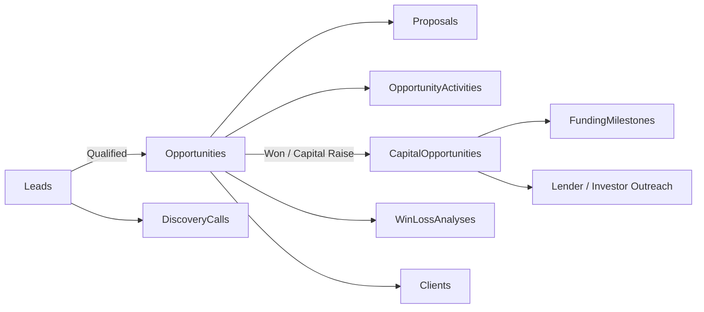

# Opportunity Management Module (CRM)

**Product:** HVCG OS  
**Module:** Opportunity CRM  
**Platform:** SharePoint lists on Command Center (immutable infrastructure baseline)  
**Status:** **Repo-ready / apply-in-progress** — packages designed and committed; live Dev schema **not yet applied** (owner-attended repair pending)  

## Purpose

Support High Value Capital Group’s full commercial lifecycle:

**Lead intake → qualify → opportunity → proposal/negotiation → win/loss → (optional) capital diligence & funding → closed deal**

Uses existing SharePoint schema as the system of record. Does **not** change deployment/provisioning engines except via additive list/column JSON and idempotent repair.

## Lifecycle map



| Phase | Primary lists | Automation |
|-------|---------------|------------|
| Lead intake | `HVCG_Leads`, Referrals, ReferralPartners | Manual / Forms intake; activity notes |
| Qualify | Leads.LeadStatus, DiscoveryCalls | `HVCG_LeadQualifiedCreateOpportunity` |
| Opportunity | Opportunities Stage Discovery→Negotiation | `HVCG_OpportunityStageChangedNotify` |
| Proposal | Proposals | Stage patch to Proposal |
| Win / Lost | WinLossStatus, WinLossAnalyses | `HVCG_OpportunityWonCloseout` |
| Diligence / funding | CapitalOpportunities.FundingStatus, FundingMilestones | `HVCG_CapitalFundingStatusNotify` |
| Closed funding | FundingStatus Closed/Declined | Bridge CapitalHandoffStatus Funded/Declined |

## Sales ↔ capital bridge

| Field | List | Role |
|-------|------|------|
| `CapitalOpportunityId` | Opportunities | Points at funding book |
| `CapitalHandoffStatus` | Opportunities | NotApplicable → Ready → HandedOff → InFunding → Funded/Declined |
| `OpportunityId` | CapitalOpportunities | Reverse link |
| `HandoffSource` | CapitalOpportunities | SalesWin / Direct / … |

## SharePoint artifacts

- Lists: `HVCG_Opportunities` (+ bridge/Copilot fields), `HVCG_OpportunityActivities` (new), `HVCG_CapitalOpportunities` (+ bridge)
- Views: Open Leads, Qualified Leads, Open Pipeline, Commit Forecast, Capital Handoffs Ready, Recent Activities, Active Capital Book
- Migration: `releases/migrations/20260715_001_opportunity_crm_module.json` + `diffs/opportunity_crm_v1.json`

### Apply to Dev (idempotent repair; owner-run when ready)

**State:** Infrastructure baseline frozen (`v1.1.0-dev-sharepoint-baseline`). Opportunity CRM additive schema is in-repo via `releases/migrations/20260715_001_opportunity_crm_module.json` + `diffs/opportunity_crm_v1.json`. Parallel agent packaging may still be merging; run repair from the **integration** commit the parent agent designates — not mid-stream agent branches.

```powershell
# Optional safety backup first
pwsh -File ./deployment/backup/Backup-HVCGOS.ps1 -Environment development

# Additive CRM schema (interactive Microsoft sign-in / consent)
pwsh -File ./deployment/repair/Repair-HVCGOSSharePointSchema.ps1 -Environment development
```

Expect: new list `HVCG_OpportunityActivities`, bridge/Copilot columns, CRM views; repair exit **0** and `hasDrift=false`. Re-run is safe (idempotent). Do not delete sites/lists.

**After repair (owner / Maker only):** bind SharePoint/Teams/Outlook connections → import four CRM flows → set test Teams channel env vars → activate → build/publish `scrCRM` / `scrOpportunityDetail` → fill `docs/crm/ACCEPTANCE_REPORT.md`.

Full stop-point checklist: `docs/crm/OWNER_ACTION_GUIDE.md`  
Parallel packaging map: `docs/crm/PARALLEL_AGENT_MAP.md`

## Power Apps

- `src/power-apps/screens/scrCRM.md`
- `src/power-apps/screens/scrOpportunityDetail.md`
- Formulas: `nfOpenPipeline`, `nfQualifiedLeads`, `nfCapitalHandoffsReady`, …
- Build sheet updated for CRM screens + CapitalAdvisor share

## Power Automate

| Flow | Trigger |
|------|---------|
| `HVCG_LeadQualifiedCreateOpportunity` | Lead → Qualified |
| `HVCG_OpportunityStageChangedNotify` | Opportunity Stage change |
| `HVCG_OpportunityWonCloseout` | Won |
| `HVCG_CapitalFundingStatusNotify` | Capital FundingStatus change |

Connections: SharePoint, Teams (+ Outlook where noted).

## Microsoft Teams

Environment variables:

- `HVCG_TEAMS_CRM_CHANNEL_ID` — pipeline / win notifications  
- `HVCG_TEAMS_CAPITAL_CHANNEL_ID` — diligence & funding status  

Recommended channels: **HVCG CRM / Pipeline**, **HVCG Capital Desk**.  
Optional: store deal war-room URL on `Opportunities.TeamsThreadUrl`.

## Copilot readiness

See `docs/crm/COPILOT_OPPORTUNITY.md`.

- Curated `CopilotSummary` / `CopilotKeywords` on Opportunities (and activities).
- No secrets in Copilot fields.
- Ground answers on pipeline Stage, handoff status, and funding status lists only.

## Tests

```powershell
python3 tests/unit/test_opportunity_crm.py
pwsh -File ./tests/Invoke-HVCGPreDeploymentTests.ps1
```

## Permissions

Follow `PERMISSIONS_MATRIX.md` for Leads/Opportunities/Capital. CapitalAdvisor + ProjectManager: day-to-day CRM; Owner: executive pipeline KPIs.
