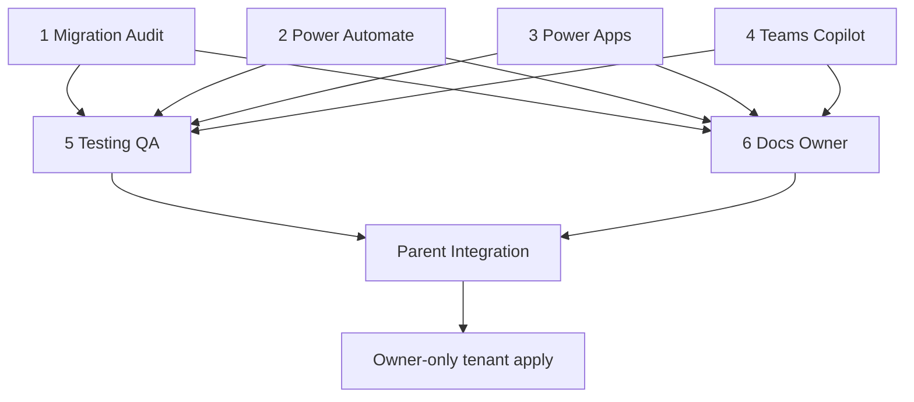

# Opportunity CRM — Parallel Agent Dependency Map

**Parent integration branch:** `agent/crm-integration`  
**Merge target (after QA):** `cursor/v1.1.0-intelligence-ai-ops`  
**Base commit:** `4a8f25d`  
**Map owner:** Parent Integration Agent (this file — authoritative)

## Operating rules

| Rule | Detail |
|------|--------|
| Exclusive paths | Agents 1–6 write only their assigned paths (below). No shared-file edits. |
| No tenant deploys | Agents must **not** repair, backup, deploy SharePoint, import/activate flows, publish Power Apps, or enable Teams notifications. |
| One repair at a time | A Development schema repair may already be running from a prior session. Never start a second concurrent repair. |
| Integration order | Parent reviews each workstream → merges **only** passing branches → resolves conflicts centrally → runs full test suite → consolidates acceptance. |
| Integration status | **All six workers PASSED (2026-07-15).** Merged into `agent/crm-integration`; full suite + consolidated acceptance owned by Parent. |

---

## Workstreams, branches, exclusive files

| # | Workstream | Branch / worktree | Exclusive paths |
|---|------------|-------------------|-----------------|
| 1 | SharePoint Migration Audit | `agent/crm-migration-audit` | `docs/crm/MIGRATION_PLAN_DEV.md`, `docs/crm/PHASE1_SAFETY_CHECK.md`, `tests/unit/test_opportunity_migration.py`; optionally one append-only line in `tests/Invoke-HVCGPreDeploymentTests.ps1` for the new test |
| 2 | Power Automate | `agent/crm-power-automate` | `src/power-automate/flows/HVCG_LeadQualifiedCreateOpportunity.json`, `HVCG_OpportunityStageChangedNotify.json`, `HVCG_OpportunityWonCloseout.json`, `HVCG_CapitalFundingStatusNotify.json`; matching `src/power-automate/definitions/*`; CRM-only entries in `flows/_index.json` and `definitions/_index.json`; `docs/crm/POWER_AUTOMATE_OWNER_GUIDE.md`, `docs/crm/FLOW_PACKAGE_MATRIX.md` |
| 3 | Power Apps | `agent/crm-power-apps` | `src/power-apps/screens/scrCRM.md`, `scrOpportunityDetail.md`; CRM section of `formulas/NamedFormulas.fx`; CRM sections of `BUILD_SHEET.md`; CRM nav in `README.md` if needed; `docs/crm/POWER_APPS_BUILD_GUIDE.md`; optional `src/power-apps/crm/*` |
| 4 | Teams & Copilot | `agent/crm-teams-copilot` | `docs/crm/TEAMS_COPILOT_READINESS.md`, `docs/crm/COPILOT_OPPORTUNITY.md`, `docs/crm/TEAMS_NOTIFICATION_SPEC.md` |
| 5 | Testing & QA | `agent/crm-testing-qa` | `tests/unit/test_opportunity_lifecycle.py`, `tests/crm/*`, `scripts/Test-HVCGOpportunityCrmAcceptance.ps1`, `docs/crm/SMOKE_TEST_CHECKLIST.md`; append-only checks in `tests/Invoke-HVCGPreDeploymentTests.ps1` for agent-5 tests only |
| 6 | Docs & Owner Actions | `agent/crm-docs-owner` | `docs/crm/OWNER_ACTION_GUIDE.md`, `docs/crm/ACCEPTANCE_REPORT.md`, `docs/crm/OPPORTUNITY_MANAGEMENT.md` (status/apply sections only), `PROJECT_STATUS.md`, `NEXT_SESSION.md` |
| P | Parent Integration | `agent/crm-integration` | **`docs/crm/PARALLEL_AGENT_MAP.md`** (this file — soft ownership among `docs/crm/` during live smoke); merge coordination; do **not** rewrite CRM acceptance during Maker OA/smoke |

### Soft conflicts (merge carefully)

- `tests/Invoke-HVCGPreDeploymentTests.ps1` — agents 1 and 5 may each append their own check lines; parent rebases/merges appends.
- Agent 6 was briefed that it *may* restore a concept map; **defer to this Parent file** — do not rewrite `PARALLEL_AGENT_MAP.md` on the docs-owner branch.

---

## Dependencies

| Consumer | Needs from producers |
|----------|----------------------|
| Agent 5 (QA) | Readable artifacts from 1–4 (schema plan, flows, app specs, Teams/Copilot docs) — offline tests; may start in parallel reading base `4a8f25d` and harden as peers land |
| Agent 6 (Docs) | Guides and status aligned with 1–4 outputs; acceptance placeholders until parent consolidates live results |
| Parent | All six branches at **pass**; then integration merge + full suite |
| Owner (human) | Parent greenlight + acceptance checklist — only then tenant actions |

**Parallelizable now (repo-only):** Agents 1, 2, 3, 4 (and docs/tests drafting) on exclusive paths from `4a8f25d`.

---

## Sequential tenant tasks (cannot parallelize)

1. **Pre-change backup** — completed or owned by prior session; do not re-run concurrently.
2. **Single Development schema repair** — idempotent apply of Opportunity CRM migration; never two repairs at once.
3. **Owner: Power Automate** — connection bind → import packages → activate (test recipients / Off by default until approved).
4. **Owner: Power Apps** — Maker build/import → publish (after schema + data sources exist).
5. **Owner: Teams / Copilot** — channel packaging, notification enablement with **human approval** for outbound comms.
6. **Owner: Live smoke / acceptance** — Development checklist and acceptance report fill-in.

---

## Critical path (estimate)

| Phase | Work | Estimate |
|-------|------|----------|
| Parallel track A | Migration audit docs + tests | 30–45 min |
| Parallel track B | Power Automate packages + owner guide | 45–60 min |
| Parallel track C | Power Apps screen/formula specs + build guide | 45–60 min |
| Parallel track D | Teams + Copilot readiness specs | 20–30 min |
| After A–D drafts | Testing/QA lifecycle + smoke checklist | 30–45 min |
| Parallel with QA | Owner action guide + session status | ~30 min |
| Integration | Parent merge of six passes + full suite | 20–30 min |
| **Stop for human** | Dev repair (if not done) → flow import → app publish → Teams activate → live smoke | Owner-gated |

**Longest repo-only critical path:** Power Automate **or** Power Apps (~60m) → Testing (~45m) → Integration (~30m) ≈ **~2–2.5 hours**, then owner-only tenant work.

---

## Owner-only actions (automation must stop)

- Microsoft sign-in, consent, and connector binding
- SharePoint Development repair / schema apply
- Flow import and activation in Maker
- Canvas app publish
- Teams notification enablement / org channel wiring
- Any outbound email or Teams message beyond documented test recipients
- Production (or non-Dev) apply

---

## Pass criteria (before Parent merges)

| Agent | Pass signal |
|-------|-------------|
| 1 | Commit `crm(audit): Opportunity CRM migration plan and tests` on `agent/crm-migration-audit` |
| 2 | Commit `crm(flows): harden Opportunity CRM Power Automate packages` on `agent/crm-power-automate` |
| 3 | Commit `crm(apps): complete Opportunity CRM canvas specifications` on `agent/crm-power-apps` |
| 4 | Commit `crm(teams): Teams and Copilot readiness specs` on `agent/crm-teams-copilot` |
| 5 | Commit `crm(test): Opportunity CRM lifecycle tests and smoke checklist`; acceptance script offline mode PASS |
| 6 | Commit `crm(docs): owner actions and session status for Opportunity CRM` on `agent/crm-docs-owner` |

Parent then merges into `agent/crm-integration`, runs the full test suite, and produces one consolidated acceptance report — still **without** tenant deploy unless explicitly approved.

---

## Parent integration checklist

- [x] All six agent commits present and review-passed
- [x] Soft conflicts resolved (`Invoke-HVCGPreDeploymentTests.ps1` keep-all checks; this map kept as Parent authority)
- [x] `Invoke-HVCGPreDeploymentTests.ps1` + CRM unit tests green
- [x] Consolidated acceptance: `docs/crm/CONSOLIDATED_ACCEPTANCE_REPORT.md`
- [ ] Explicit owner approval recorded before repair / import / publish

## Change log

| Date | Change |
|------|--------|
| 2026-07-15 | Parent authoritative map (`c31b25d`); docs-owner alternate map deferred on merge |
| 2026-07-15 | All six workers passed; integration merge + full suite PASS; consolidated acceptance written |
| 2026-07-15 | Soft ownership clarified: Integration owns this map only under `docs/crm/` during live smoke; cross-module merge packets in `docs/integration/` (D-003 held) |
