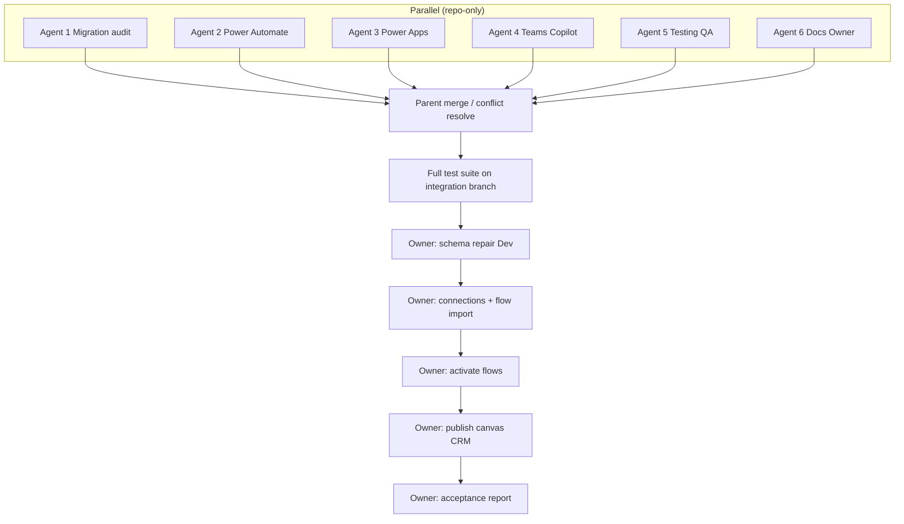

# Opportunity CRM — Parallel Agent Map

**Purpose:** Non-overlapping file ownership, merge order, and sequential tenant gates for the Opportunity CRM acceleration workstreams.  
**Base commit:** `4a8f25d` (`docs: add NEXT_SESSION.md after Opportunity CRM v1`) on `cursor/v1.1.0-intelligence-ai-ops`  
**Integration rule:** Merge only passing agent branches into one integration branch; resolve conflicts centrally; run full test suite before any owner apply.

---

## Workstreams

| Agent | Stream | Branch | Suggested worktree | Deploy / publish? |
|-------|--------|--------|--------------------|-------------------|
| **1** | SharePoint migration audit | `agent/crm-migration-audit` | `.worktrees/crm-migration-audit` | **No** |
| **2** | Power Automate packages | `agent/crm-power-automate` | `.worktrees/crm-power-automate` | **No** (no Maker import) |
| **3** | Power Apps canvas specs | `agent/crm-power-apps` | `.worktrees/crm-power-apps` | **No** (no publish) |
| **4** | Teams + Copilot readiness | `agent/crm-teams-copilot` | `.worktrees/crm-teams-copilot` | **No** (no Teams publish) |
| **5** | Testing & QA | `agent/crm-testing-qa` | `.worktrees/crm-testing-qa` | **No** (no live repair) |
| **6** | Documentation & owner actions | `agent/crm-docs-owner` | `.worktrees/crm-docs-owner` | **No** |
| **Parent** | Integration + acceptance | `agent/crm-integration` (or similar) | main / dedicated WT | **No** until owner approval |

---

## Exclusive path ownership (do not cross)

### Agent 1 — Migration audit

- `docs/crm/MIGRATION_PLAN_DEV.md`
- `docs/crm/PHASE1_SAFETY_CHECK.md`
- `tests/unit/test_opportunity_migration.py`
- `tests/Invoke-HVCGPreDeploymentTests.ps1` — **append-only** check for the new migration test

### Agent 2 — Power Automate

- `src/power-automate/flows/HVCG_LeadQualifiedCreateOpportunity.json`
- `src/power-automate/flows/HVCG_OpportunityStageChangedNotify.json`
- `src/power-automate/flows/HVCG_OpportunityWonCloseout.json`
- `src/power-automate/flows/HVCG_CapitalFundingStatusNotify.json`
- Matching `src/power-automate/definitions/*`
- `src/power-automate/flows/_index.json` / `definitions/_index.json` — CRM entries only
- `docs/crm/POWER_AUTOMATE_OWNER_GUIDE.md`
- `docs/crm/FLOW_PACKAGE_MATRIX.md`

### Agent 3 — Power Apps

- `src/power-apps/screens/scrCRM.md`
- `src/power-apps/screens/scrOpportunityDetail.md`
- `src/power-apps/formulas/NamedFormulas.fx` — CRM formulas only
- `src/power-apps/BUILD_SHEET.md` — CRM sections
- `src/power-apps/README.md` — CRM nav only if needed
- `docs/crm/POWER_APPS_BUILD_GUIDE.md`
- Optional `src/power-apps/crm/**`

### Agent 4 — Teams & Copilot

- `docs/crm/TEAMS_COPILOT_READINESS.md`
- `docs/crm/COPILOT_OPPORTUNITY.md`
- `docs/crm/TEAMS_NOTIFICATION_SPEC.md`

### Agent 5 — Testing & QA

- `tests/unit/test_opportunity_lifecycle.py`
- `tests/crm/**`
- `scripts/Test-HVCGOpportunityCrmAcceptance.ps1`
- `docs/crm/SMOKE_TEST_CHECKLIST.md`
- `tests/Invoke-HVCGPreDeploymentTests.ps1` — **append-only** checks for Agent 5 tests

### Agent 6 — Documentation & owner actions

- `docs/crm/OWNER_ACTION_GUIDE.md`
- `docs/crm/ACCEPTANCE_REPORT.md`
- `docs/crm/PARALLEL_AGENT_MAP.md` (this file)
- `docs/crm/OPPORTUNITY_MANAGEMENT.md` — **status / apply sections only**
- `PROJECT_STATUS.md`
- `NEXT_SESSION.md`

### Shared / forbidden for parallel agents

| Path | Rule |
|------|------|
| `releases/migrations/diffs/opportunity_crm_v1.json` | Read-only for Agents 1–6 during parallel; Parent resolves if edits needed |
| `deployment/lib/**`, Deploy/Repair engines | Frozen — do not edit unless confirmed defect (out of CRM parallel scope) |
| Live tenant | **No concurrent deploys**; Parent + owner only, after merge |

---

## Dependency graph

**Soft dependencies (docs only, not blocking parallel start):**

- Agent 5 may assert presence of Agent 2–3 artifacts; prefer testing committed HEAD packages, then re-run after merge.
- Agent 6 documents stop points independently; update acceptance placeholders after Parent merge SHA is known.
- Agent 4 references flow/channel env vars produced by Agent 2 packages — read-only.

---

## Must remain sequential (cannot parallelize on tenant)

1. **Schema repair** (owner interactive) — sole SharePoint mutator for CRM apply
2. **Connector consent + connection binding**
3. **Flow import → bind → test → activate**
4. **Canvas build/publish** (after lists exist; can draft offline specs in parallel first)
5. **Acceptance report sign-off**
6. **Any Production promote**

Repo packaging (Agents 1–6) **can** run concurrently.

---

## Critical path (estimated)

| Phase | Owner | Est. duration | Notes |
|-------|-------|---------------|-------|
| Parallel agent packaging | Agents 1–6 | 1 session | No tenant access |
| Parent review + merge + tests | Parent | Short | Block merge on failing tests |
| Schema repair + drift attest | Owner | 15–45 min | OA-CRM-01…04 |
| Connections + 4 flow imports | Owner | 30–60 min | OA-CRM-05…07 |
| Flow tests + activate | Owner | 20–40 min | OA-CRM-08 |
| Canvas publish + lifecycle UAT | Owner | 45–90 min | OA-CRM-09…10 |

**Longest critical path after merge:** owner Maker work (flows + apps), not agent coding.

---

## Parent integration checklist

- [ ] All six agent commits present and review-passed  
- [ ] No overlapping path conflicts left unresolved  
- [ ] `Invoke-HVCGPreDeploymentTests.ps1` + CRM unit tests green  
- [ ] Single acceptance artifact path: `docs/crm/ACCEPTANCE_REPORT.md`  
- [ ] Explicit owner approval recorded before repair / import / publish  

---

## Owner-only stops (summary)

Full detail: `docs/crm/OWNER_ACTION_GUIDE.md`.

1. Microsoft sign-in + consent  
2. Dev schema repair attestation  
3. Connection binding  
4. Flow import + activation  
5. Canvas publish  
6. Acceptance sign-off  
7. Production gate  

---

## Change log

| Date | Change |
|------|--------|
| 2026-07-15 | Initial map for Opportunity CRM parallel agents |
