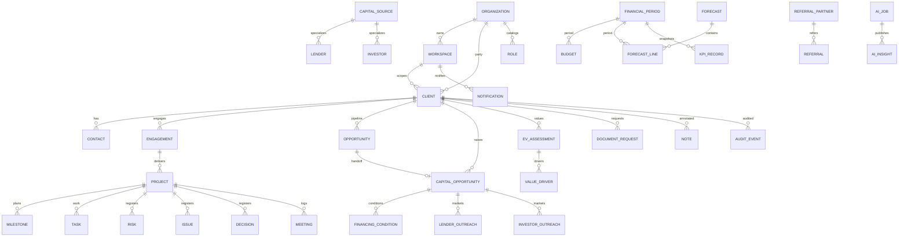

# 03 — Relationship Diagram

## Logical ERD (foundation spine)

## Join keys (stable)

| From | To | Key |
|------|----|-----|
| Most facts | Client | `ClientCode` (text) + optional `ClientId` lookup |
| Client | Organization | `OrganizationId` / `OrganizationCode` |
| Client | Workspace | `WorkspaceId` / `WorkspaceCode` |
| Opportunity | CapitalOpportunity | `CapitalOpportunityId` / `OpportunityId` bridge |
| KPI / Budget / Forecast | Period | `PeriodCode` / `FinancialPeriodId` |
| DocumentRequest | Library file | URL / DriveItem id (not duplicated content) |
| User actions | Entra | Email + `EntraObjectId` |

## Isolation edges

- Default query filter: `WorkspaceId = current workspace` **OR** (Executive workspace + role allows cross-workspace).
- `HVCG_Relationships.IsCrossClient` must remain false unless Security-approved.
- Colorado Craft Beef workspace rows must not appear in other client workspaces.

## Existing ERD

Legacy delivery/CRM diagram remains in [`../ERD.md`](../ERD.md). This foundation diagram **supersedes** it for Atlas multi-org planning.
