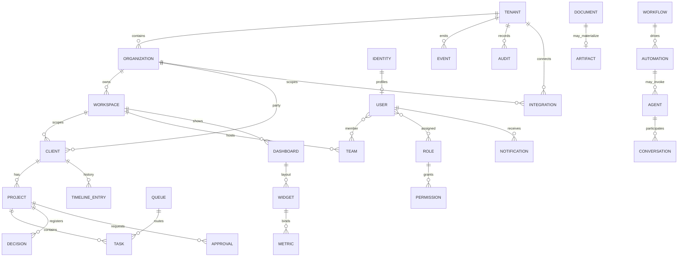

# 03 — Platform ERD

## Isolation path

`TenantId` → `Organization` → `Workspace` → (`Client` | platform resources)

Executive Dashboard uses WorkspaceType=`Executive` with Permission-gated cross-client Metric reads — not a separate schema.
