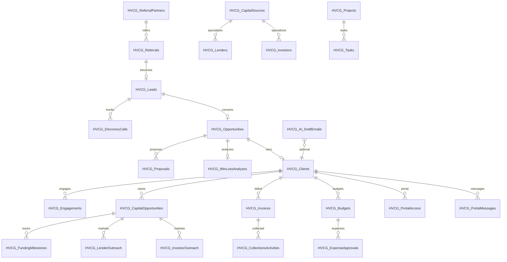

# Entity Relationship Diagram — HVCG OS

> **Platform OS (canonical):** [`ATLAS_PLATFORM_OS/03_PLATFORM_ERD.md`](ATLAS_PLATFORM_OS/03_PLATFORM_ERD.md)  
> **Product multi-org spine:** [`ATLAS_DATA_FOUNDATION/03_RELATIONSHIPS.md`](ATLAS_DATA_FOUNDATION/03_RELATIONSHIPS.md)  
> Diagram below remains the V1.1 delivery/CRM spine.

Delivery registers (Risks, Issues, Decisions, etc.) remain as in V1 core.
