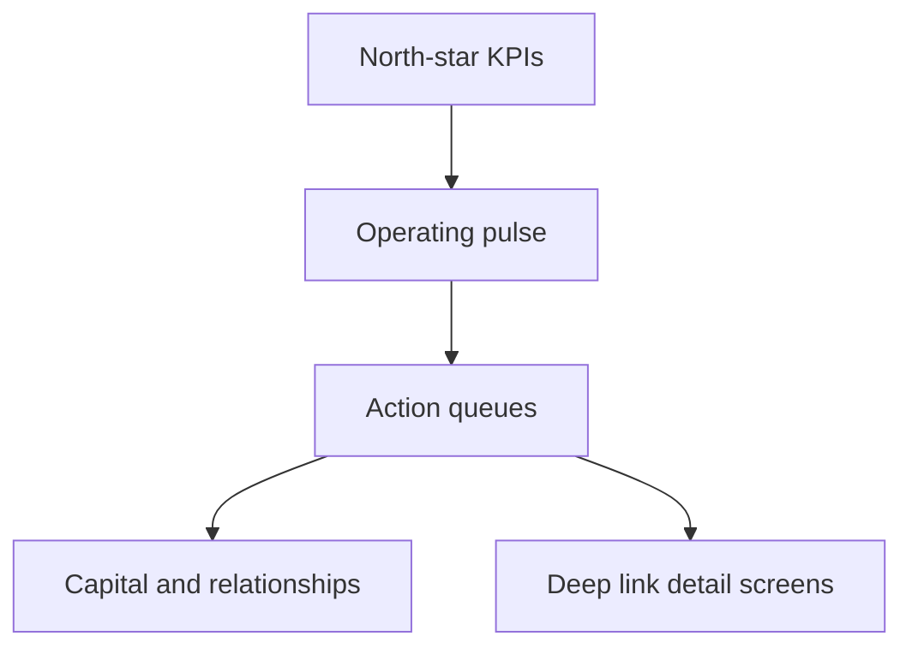

# Executive Command Center — Dashboard Spec

**Product surface:** Power Apps `scrHomeExec` + Power BI `HVCG_CEO_Command`  
**Primary user:** Owner  

## Design goals

1. Decision density over activity density.  
2. Dollar-first north-star tiles.  
3. Queues that clear or escalate — never decorative lists.  
4. Same KPI definitions across Apps and BI — canonical [`docs/analytics/METRIC_CATALOG.md`](../analytics/METRIC_CATALOG.md); aliases in `KPI_DEFINITIONS.md`.
5. Domain analytics pages per [`docs/analytics/DASHBOARDS.md`](../analytics/DASHBOARDS.md).

## Information architecture

## Noise policy

| Include | Exclude |
|---------|---------|
| Executive decisions | Low-priority task churn |
| Major risks | AI draft email queues |
| Past-due retainers / AR | Routine doc reminders |
| Commit vs pipeline | Automation log spam |
| Capital book open items | Full team task boards |

## Refresh & latency

| Surface | Latency |
|---------|---------|
| Canvas | OnVisible Refresh + user Refresh |
| Power BI | Scheduled import (Dev manual OK) |

## Accessibility

- Tile values are text, not color-only.  
- Empty states are explicit sentences.  
- Phone: Decisions before Capital.
