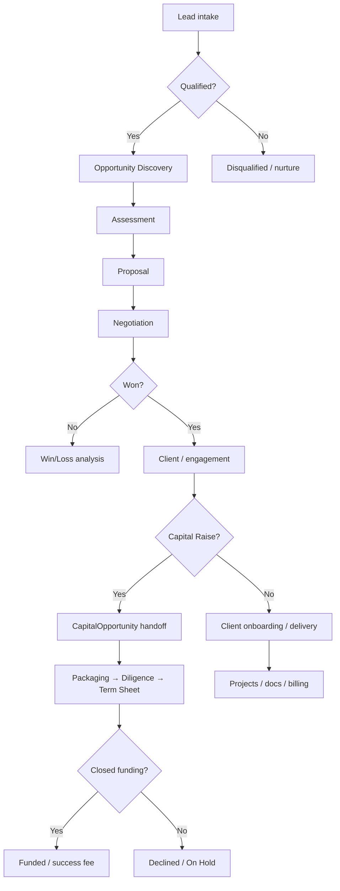
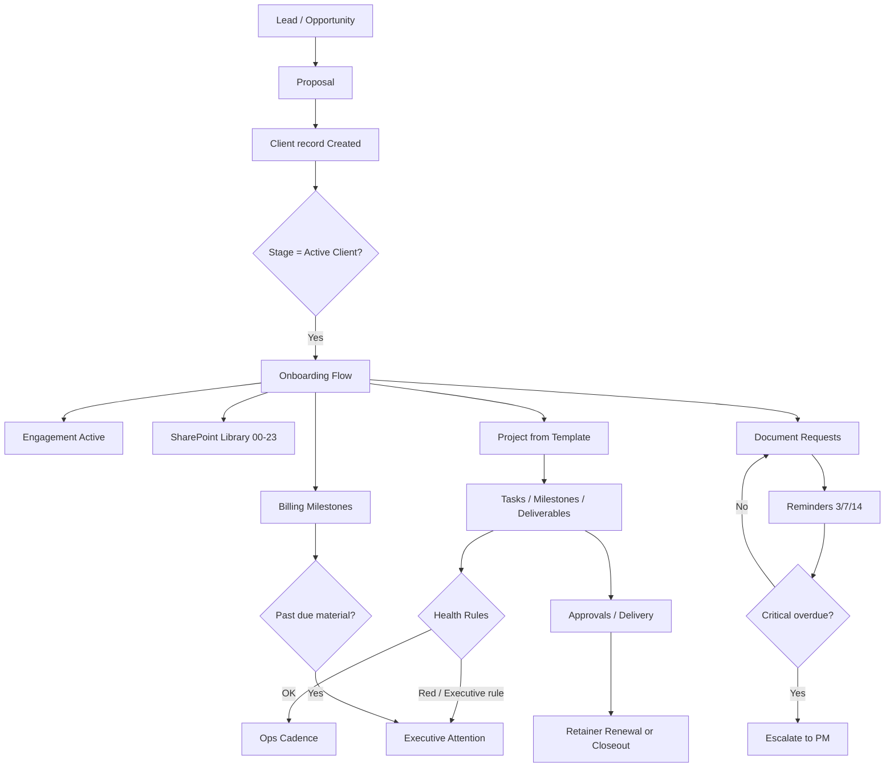

# Process Map — Lead to Funding Close (Opportunity CRM + Delivery)

```mermaid
flowchart TD
  L[Lead intake] --> Q{Qualified?}
  Q -->|Yes| O[Opportunity Discovery]
  Q -->|No| X[Disqualified / nurture]
  O --> A[Assessment]
  A --> P[Proposal]
  P --> N[Negotiation]
  N --> W{Won?}
  W -->|No| WL[Win/Loss analysis]
  W -->|Yes| C[Client / engagement]
  C --> D{Capital Raise?}
  D -->|Yes| Cap[CapitalOpportunity handoff]
  Cap --> Dil[Packaging → Diligence → Term Sheet]
  Dil --> Fund{Closed funding?}
  Fund -->|Yes| Done[Funded / success fee]
  Fund -->|No| Dec[Declined / On Hold]
  D -->|No| Onboard[Client onboarding / delivery]
  Onboard --> Del[Projects / docs / billing]
```

Legacy delivery path (post-Active Client) unchanged:

```mermaid
flowchart TD
  A[Lead / Opportunity] --> B[Proposal]
  B --> C[Client record Created]
  C --> D{Stage = Active Client?}
  D -->|Yes| E[Onboarding Flow]
  E --> F[Engagement Active]
  E --> G[SharePoint Library 00-23]
  E --> H[Project from Template]
  E --> I[Document Requests]
  E --> J[Billing Milestones]
  H --> K[Tasks / Milestones / Deliverables]
  I --> L[Reminders 3/7/14]
  L --> M{Critical overdue?}
  M -->|Yes| N[Escalate to PM]
  M -->|No| I
  K --> O{Health Rules}
  O -->|Red / Executive rule| P[Executive Attention]
  O -->|OK| Q[Ops Cadence]
  J --> R{Past due material?}
  R -->|Yes| P
  K --> S[Approvals / Delivery]
  S --> T[Retainer Renewal or Closeout]
```

See `docs/crm/OPPORTUNITY_MANAGEMENT.md` for the Opportunity CRM module.
