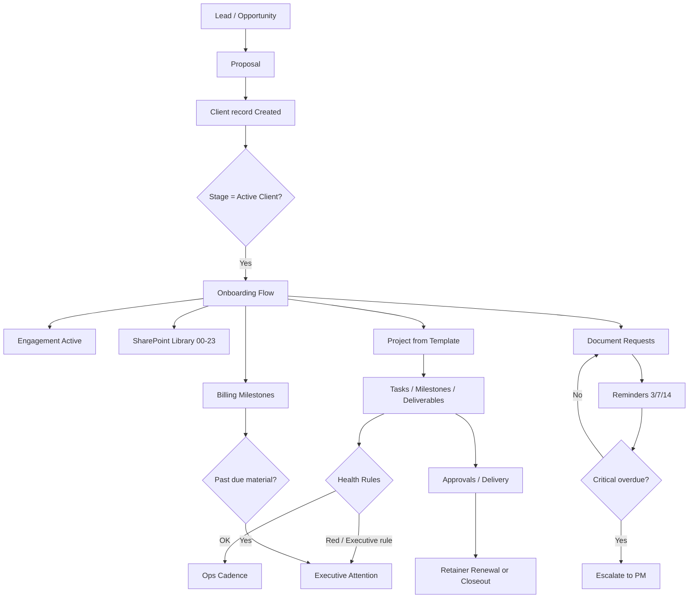

# Process Map — Client to Delivery (V1)

```mermaid
flowchart TD
  A[Lead / Opportunity] --> B[Proposal]
  B --> C[Client record Created]
  C --> D{Stage = Active Client?}
  D -->|Yes| E[Onboarding Flow]
  E --> F[Engagement Active]
  E --> G[SharePoint Library 00-23]
  E --> H[Project from Template]
  E --> I[Document Requests]
  E --> J[Billing Milestones]
  H --> K[Tasks / Milestones / Deliverables]
  I --> L[Reminders 3/7/14]
  L --> M{Critical overdue?}
  M -->|Yes| N[Escalate to PM]
  M -->|No| I
  K --> O{Health Rules}
  O -->|Red / Executive rule| P[Executive Attention]
  O -->|OK| Q[Ops Cadence]
  J --> R{Past due material?}
  R -->|Yes| P
  K --> S[Approvals / Delivery]
  S --> T[Retainer Renewal or Closeout]
```
