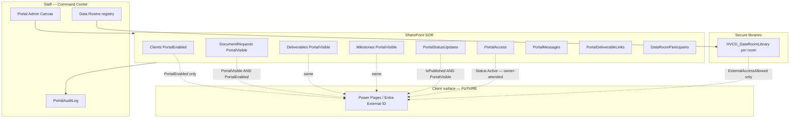

# Client Portal & Secure Data Rooms — Architecture

**Product:** HVCG OS  
**Module:** ClientPortalDataRooms  
**Branch:** `cursor/client-portal-data-rooms` (exclusive; ECC branch reserved for Executive package)  
**Status:** Repo-ready / Dev-gated — **external access disabled by default**  
**Environment target:** Development only (no Production deploy from this package)

## Purpose

Provide a Development-ready blueprint for:

1. **Client-facing portal surface** (Power Pages preferred; staff Power Apps admin console now)
2. **PortalVisible / PortalEnabled** visibility gates
3. Client document requests, deliverables, milestones, and status updates
4. **Secure data rooms** with library templates and sharing controls
5. Role-based visibility, audit logging, and client notification specs

This module does **not** enable external sharing, invite guests, modify deployment/authentication code, or change CRM flows.

## Hard safety invariants

| Invariant | Default | Enforcement |
|-----------|---------|-------------|
| Org / site external sharing | Unchanged (Dev = Disabled) | Never flipped by this package |
| `Clients.PortalEnabled` | `false` | App + flow gates |
| `Clients.ExternalAccessAllowed` | `false` (new) | Required before any guest path |
| `DataRooms.ExternalSharingMode` | `Disabled` | Schema default |
| `DataRooms.ExternalAccessAllowed` | `false` | Schema default |
| `DataRoomParticipants.InviteSent` | `false` | Flows refuse to set true |
| Anonymous / “anyone” links | Blocked | Library template + SOP |
| Client notifications outbound | Off | `HVCG_PORTAL_ENABLE_CLIENT_NOTIFY=false` |
| AI → portal delivery | Forbidden | Aligns with ExternalSendBlocked |

## Domain map

## Existing foundation (do not redesign)

Already provisioned in v1.x:

- `HVCG_PortalAccess`, `HVCG_PortalMessages`, `HVCG_PortalDeliverableLinks`
- `PortalVisible` on DocumentRequests / Deliverables
- `PortalEnabled` + `PortalAccessGroup` on Clients
- Client libraries via `HVCG_ClientLibrary.template.json`
- Config site slot `sites.secureDataRooms.enabled: false` (left unchanged)

## New entities (this module)

| List | Role |
|------|------|
| `HVCG_DataRooms` | Room registry + sharing mode + portal gate |
| `HVCG_DataRoomParticipants` | Planned participants (no auto-invite) |
| `HVCG_PortalStatusUpdates` | Client-safe narrative status |
| `HVCG_PortalAuditLog` | Portal/data-room audit events |

## Visibility stack

A row is client-eligible only when **all** are true:

1. `Clients.PortalEnabled = true` (still default false)
2. Entity `PortalVisible = true` (or StatusUpdate `IsPublished` + `PortalVisible`)
3. For data room content: `DataRooms.PortalEnabled` and library ACL allow the contact
4. For guests: `ExternalAccessAllowed` at client **and** room + `ExternalShare` approval + InviteMode ManualOnly

## Isolation model

- Prefer **library-per-room** under Clients hub (`HVCG_DR_{ClientCode}_{RoomKey}`) using `HVCG_DataRoomLibrary.template.json`.
- Optional fourth site `HVCG-DataRooms-Dev` remains **config-disabled**; enabling it is an owner decision (see `SHARED_FILE_RECOMMENDATIONS.md`) — this package never flips `enabled`.
- Broken inheritance; staff role grants only by default.

## Surfaces

| Surface | Now | Later |
|---------|-----|-------|
| Staff portal admin | Power Apps screens (`scrPortalAdmin`, `scrDataRooms`) | Same |
| Client experience | Spec only; Power Pages recommended | Authenticated Power Pages |
| Notifications | Staff-only queue / audit BlockedExternal | Owner-gated client email |
| Flows | Off by default; no guest invite actions | Same until owner activates |

## Migration

- `releases/migrations/20260715_002_client_portal_data_rooms.json`
- Diff: `releases/migrations/diffs/client_portal_data_rooms_v1.json`
- Apply: owner-attended `Repair-HVCGOSSharePointSchema.ps1` **after** integration merges module index recommendations

## Out of scope (explicit)

- Enabling external sharing on any site
- Inviting B2B / guest users
- Production deployment
- Editing `deployment/**`, auth registration scripts, CRM flow packages
- Autonomous AI portal messages
